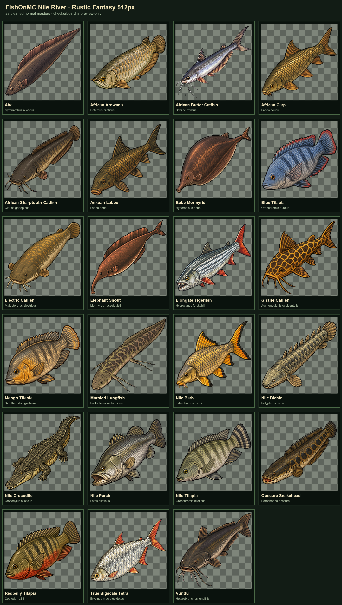

# FishOnMC Rustic Fantasy — Fish Only

An unofficial fish-only replacement texture pack for FishOnMC, available in 128px and experimental
512px editions. It contains fish artwork only: no rods, reels, lines, bait, armor, menus, cosmetics, or
other item replacements.

This project is not affiliated with or endorsed by FishOnMC, Mojang, or Microsoft.

## Contents

- 3,701 fish textures per resolution;
- 370 fish identifiers;
- normal, albino, alternate, fabled, frozen, locked, melanistic, spooky, trophy, and zombie folders;
- two small generated-item model definitions repairing missing Fabled Common Remora and Meanmouth Bass
  routes in the compatible official-pack snapshot.

The textures use a semi-realistic Rustic Fantasy direction while retaining hard pixel edges, readable
silhouettes, transparent backgrounds, and Minecraft-compatible presentation.

## Nile River preview

Version 3.1.0-nile-preview adds 23 newly released Nile River catches in all ten variants—230 new
textures per resolution:

Aba, African Arowana, African Butter Catfish, African Carp, African Sharptooth Catfish, Assuan Labeo,
Bebe Mormyrid, Blue Tilapia, Electric Catfish, Elephant Snout, Elongate Tigerfish, Giraffe Catfish,
Mango Tilapia, Marbled Lungfish, Nile Barb, Nile Bichir, Nile Crocodile, Nile Perch, Nile Tilapia,
Obscure Snakehead, Redbelly Tilapia, True Bigscale Tetra, and Vundu.

The release provides two downloads:

| Edition | Recommended for | Notes |
| --- | --- | --- |
| **128px** | Normal play | The recommended Minecraft-scale edition and the source tracked in this repository. |
| **512px** | Maximum-detail testing | Experimental, much larger download and heavier resource use. |

Enable only one resolution at a time. Both archives contain the same 370 identifiers and ten variant
folders.

## Texture preview

<table>
  <tr>
    <td align="center"> <b>Bluegill</b> · Normal</td>
    <td align="center"> <b>Arapaima</b> · Normal</td>
    <td align="center"> <b>Greenland Shark</b> · Normal</td>
  </tr>
  <tr>
    <td align="center"> <b>Showa Koi</b> · Normal</td>
    <td align="center"> <b>Common Remora</b> · Fabled</td>
    <td align="center"> <b>Alligator Gar</b> · Albino</td>
  </tr>
</table>

These are actual transparent files shipped in the pack, displayed without replacement mockups.

## Installation

1. Download either the 128px or 512px release ZIP. The 128px edition is recommended.
2. Put the ZIP in the selected Minecraft instance's `resourcepacks` directory.
3. Open Minecraft's Resource Packs screen and enable the chosen **Rustic Fantasy — Fish Only** pack.
4. For single-player testing, keep it above any locally installed FishOnMC/repaired pack.
5. Reload resources or restart Minecraft.

If default fish sprites still appear, confirm this pack is at the highest applicable priority. The pack
expects FishOnMC's normal item-model routing and replaces only the textures those routes select.

## FishOn visual suite

The three projects work independently and are designed to complement one another:

- **Rustic Fantasy 128 — Fish Only** replaces the fish artwork.
- [FishOn Fish Scale](https://github.com/finalpantasy/fishon-fish-scale)
  renders dropped catches at their recorded physical length.
- [FishOn Standing Camera](https://github.com/finalpantasy/fishon-standing-camera)
  keeps the first-person view upright while using Sneak for fishing tension.

## Multiplayer pack priority

Vanilla Minecraft pins the server resource pack above local resource packs. For FishOnMC multiplayer,
install [ServerPackOverlay](https://modrinth.com/mod/serverpackoverlay) 1.0 for Fabric and Minecraft
1.21.11. This release is already marked for that mod, so it promotes **only this fish pack** above the
pinned server pack whenever you connect:

`Rustic Fantasy fish textures → FishOnMC server packs → unmarked local packs → vanilla Minecraft`

Resource packs are resolved one asset path at a time. This fish-only pack overrides matching fish paths;
anything it does not contain still falls through to FishOnMC's official server pack. It does not make
unreplaced rods, UI, armor, blocks, or items revert to vanilla.

Do **not** use the broad `Serverpack Priority` mod with this setup. That mod lowers the server pack beneath
every enabled local pack. Packs such as Faithful can then restore their vanilla hearts, armor, and hunger
sprites over FishOnMC's custom HUD—the exact overlay this selective setup prevents.

### Fix hearts, armor, or hunger appearing over the FishOnMC HUD

1. Close Minecraft completely.
2. Remove or disable `serverpack-priority-*.jar` in the instance's `mods` directory.
3. Install [ServerPackOverlay 1.0](https://modrinth.com/mod/serverpackoverlay) instead.
4. Replace any older Rustic Fantasy ZIP with the current release; the current `pack.mcmeta` starts with the
   required hidden `§kSPO§r` marker.
5. Enable the fish pack, restart Minecraft, and reconnect. ServerPackOverlay promotes the marked fish pack
   automatically while leaving FishOnMC's server packs above Faithful, dark-mode packs, PBR packs, and other
   unmarked local packs.

## Scope and provenance

The public repository contains only the fish texture tree, its pack metadata/icon, and two minimal model
route repairs. It does not contain downloaded FishOnMC server packs, original official texture files,
research archives, worlds, logs, account information, or the unreleased rod/item replacement work.

A pre-publication SHA-256 comparison found zero byte-identical matches between these 3,471 PNG files and
the 2,431 fish PNG hashes in the locally cached official-pack snapshot. See [RIGHTS.md](RIGHTS.md) for the
artwork and compatibility notice.

## Development disclosure

The project maintainer directed the art style, selected and rejected generations, corrected
transparency, specified orientation and inventory fill, tested the textures in Minecraft, and approved
the release. OpenAI image and coding tools were used extensively to assist with image generation,
processing, documentation, and validation. The artwork is therefore shared on GitHub rather than
Modrinth.

## License

The replacement artwork is shared under the terms in [LICENSE.md](LICENSE.md). FishOnMC names, marks,
game content, and underlying designs remain the property of their respective owners.
