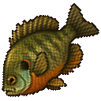
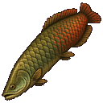
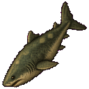
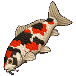
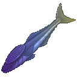
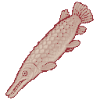

# FishOnMC Rustic Fantasy 128 — Fish Only

An unofficial 128px replacement texture pack for FishOnMC fish. It contains fish artwork only: no rods,
reels, lines, bait, armor, menus, cosmetics, or other item replacements.

This project is not affiliated with or endorsed by FishOnMC, Mojang, or Microsoft.

## Contents

- 3,471 fish textures;
- 347 fish identifiers;
- normal, albino, alternate, fabled, frozen, locked, melanistic, spooky, trophy, and zombie folders;
- two small generated-item model definitions repairing missing Fabled Common Remora and Meanmouth Bass
  routes in the compatible official-pack snapshot.

The textures use a semi-realistic Rustic Fantasy direction while retaining hard pixel edges, readable
silhouettes, transparent backgrounds, and Minecraft-compatible presentation.

## Texture preview

<table>
  <tr>
    <td align="center"> <b>Bluegill</b> · Normal</td>
    <td align="center"> <b>Arapaima</b> · Normal</td>
    <td align="center"> <b>Greenland Shark</b> · Normal</td>
  </tr>
  <tr>
    <td align="center"> <b>Showa Koi</b> · Normal</td>
    <td align="center"> <b>Common Remora</b> · Fabled</td>
    <td align="center"> <b>Alligator Gar</b> · Albino</td>
  </tr>
</table>

These are the actual transparent 128×128 files shipped in the pack, displayed without smoothing or
replacement mockups.

## Installation

1. Download the release ZIP.
2. Put the ZIP in the selected Minecraft instance's `resourcepacks` directory.
3. Open Minecraft's Resource Packs screen and enable **Rustic Fantasy 128 — Fish Only**.
4. Keep it above the official FishOnMC/repaired texture pack in the priority list.
5. Reload resources or restart Minecraft.

If default fish sprites still appear, confirm this pack is at the highest applicable priority. The pack
expects FishOnMC's normal item-model routing and replaces only the textures those routes select.

## FishOn visual suite

The three projects work independently and are designed to complement one another:

- **Rustic Fantasy 128 — Fish Only** replaces the fish artwork.
- [FishOn Fish Scale](https://github.com/finalpantasy/fishon-fish-scale)
  renders dropped catches at their recorded physical length.
- [FishOn Standing Camera](https://github.com/finalpantasy/fishon-standing-camera)
  keeps the first-person view upright while using Sneak for fishing tension.

## Multiplayer pack priority

Vanilla Minecraft places the server resource pack above local resource packs. For FishOnMC multiplayer,
install [Serverpack Priority](https://modrinth.com/mod/serverpack-priority) version 1.0.2 for Minecraft
1.21.11. It places enabled local packs above the server pack while keeping the server pack above vanilla:

`Rustic Fantasy fish textures → official FishOnMC server pack → vanilla Minecraft`

Resource packs are resolved one asset path at a time. This fish-only pack overrides matching fish paths;
anything it does not contain still falls through to FishOnMC's official server pack. It does not make
unreplaced rods, UI, armor, blocks, or items revert to vanilla.

## Scope and provenance

The public repository contains only the fish texture tree, its pack metadata/icon, and two minimal model
route repairs. It does not contain downloaded FishOnMC server packs, original official texture files,
research archives, worlds, logs, account information, or the unreleased rod/item replacement work.

A pre-publication SHA-256 comparison found zero byte-identical matches between these 3,471 PNG files and
the 2,431 fish PNG hashes in the locally cached official-pack snapshot. See [RIGHTS.md](RIGHTS.md) for the
artwork and compatibility notice.

## Development disclosure

`finalpantasy` directed the art style, selected and rejected generations, corrected transparency,
specified orientation and inventory fill, tested the textures in Minecraft, and approved the release.
OpenAI image and coding tools were used extensively to assist with image generation, processing,
documentation, and validation. The artwork is therefore shared on GitHub rather than Modrinth.

## License

The replacement artwork is shared under the terms in [LICENSE.md](LICENSE.md). FishOnMC names, marks,
game content, and underlying designs remain the property of their respective owners.
